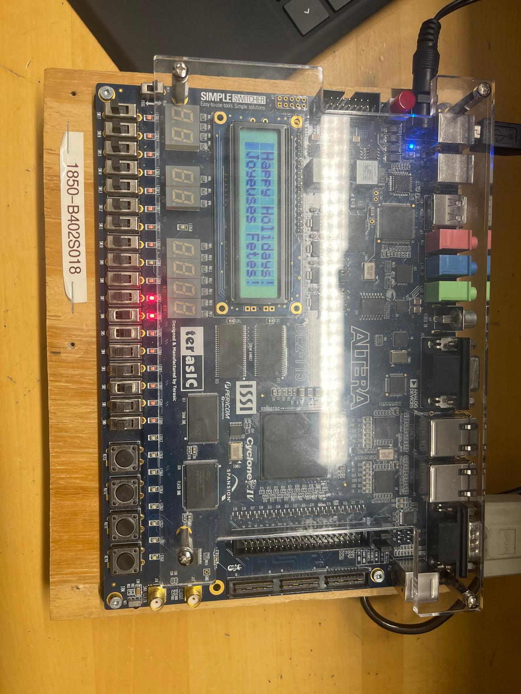

# 🚦 FPGA Traffic Light UART
  

  
  

  
## Overview

**FPGA Traffic Light UART** is a project implemented entirely in **VHDL** that demonstrates a traffic light control system on an FPGA. The design includes a **UART (Universal Asynchronous Receiver-Transmitter)** interface to enable communication with external devices. This project is designed specifically for the **Altera DE2 FPGA development board**.

## Features

- 🚥 Simulates intersection traffic lights with a clear control logic.
- 🔗 UART interface to facilitate external communication and modifications.
- 📜 Fully implemented in VHDL with compatibility for FPGA synthesis.

## How It Works

The traffic light system follows a predefined state machine, managing signals for stop, caution, and go lights. Communication via the UART module allows external monitoring or dynamic control of the system through serial communication.

The design is synthesized and programmed onto the Altera DE2 FPGA development board, which serves as the hardware platform. The board’s LEDs and switches are used to indicate and control the traffic light states.

## Requirements

- 🛠 **Hardware:** Altera DE2 FPGA development board
- 💻 **Software:** Intel Quartus Prime (for synthesis and programming)

## Usage

1. 📥 Clone the repository.
2. ⚙️ Open the project in Intel Quartus Prime and configure the pin assignments for the DE2 board.
3. 🔨 Synthesize the design, implement it, and program the FPGA.
4. 🖧 Connect to the UART module via a terminal program such as PuTTY or Tera Term.
5. 🚦 Observe the traffic light behavior and interact through UART.

## Language

This project is written entirely in **VHDL**.
